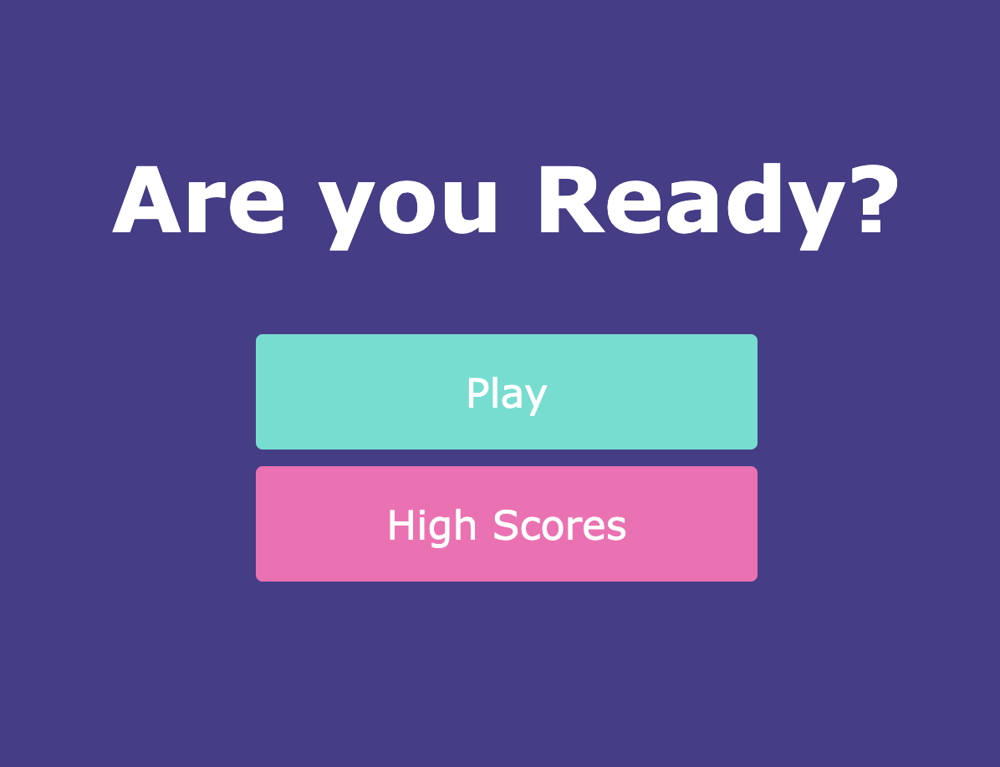
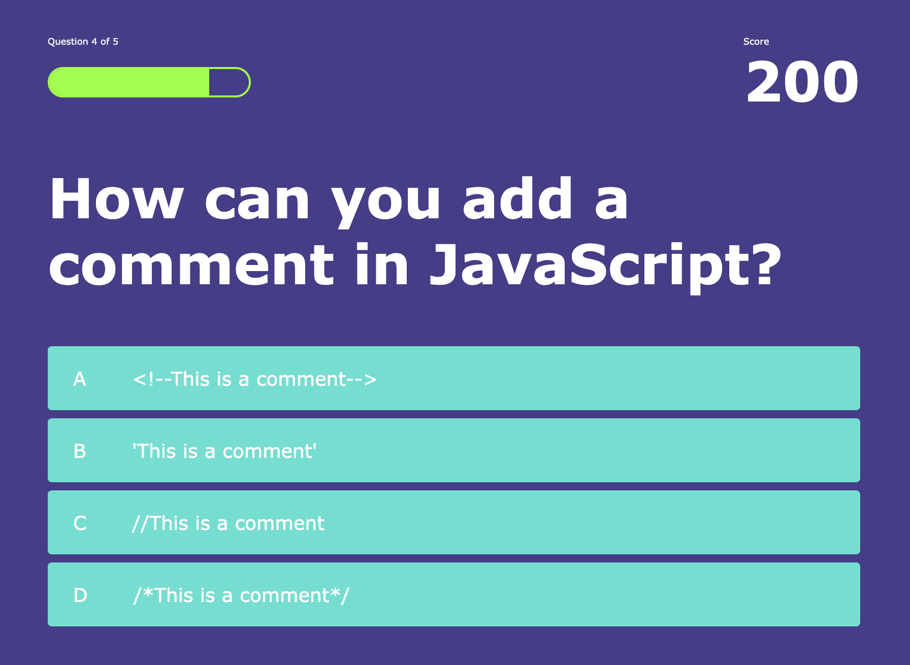
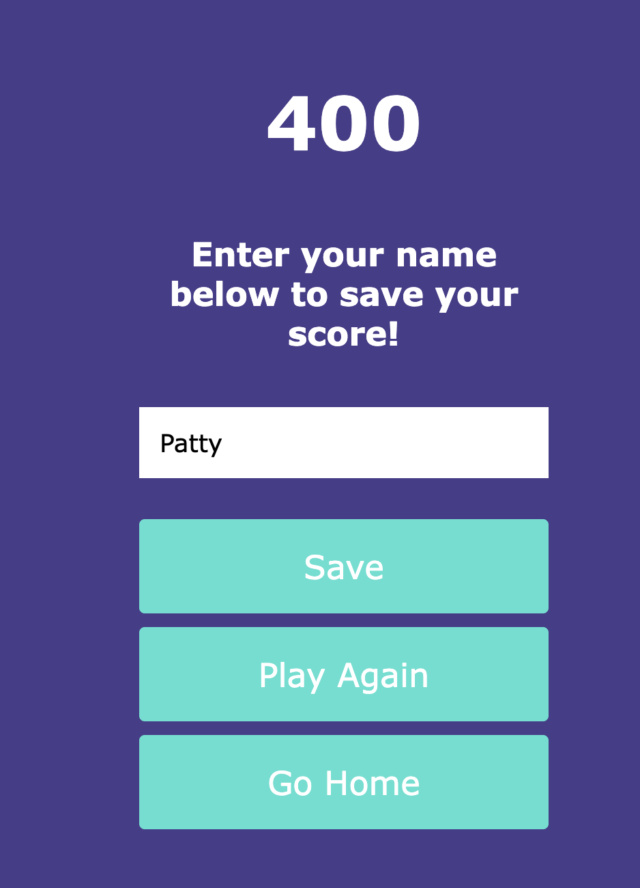

# Javascript Quiz - UCF Bootcamp Challenge #4

## An interactive quiz to test basic JavaScript knowledge

- Presented with a challenge to create an interactice quiz from scratch
- Created multiple linked web pages using HTML, CSS & JavaScript to provide an interactive quiz expreience
- Ability to save high scores and view them on a Leaderboard utilizing local storage

##Installation

- No install needed! Just vist the deployed application at: https://pmanecci.github.io/pm-javascript-quiz/

##Usage

- On the Home Page click the Play button to take the quiz

- Answer each question - Correct answer buttons flash green and award 100 points - Incorrect answer buttons flash red and no points are awarded. 
- Quiz progress is shown in the upper left and current score is in the upper right

- After all 5 questions are answered you will have the option to save your Final Score by entering your name, replay the quiz, or return to the Home Page

- View the High Scores Leaderboard by clicking on the High Scores button on the Home Page
- The top 5 scores will be shown on the Leaderboard

